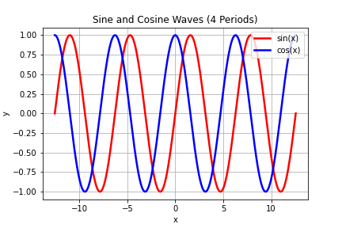

# [Plots README](github.com/LafeLabs/plots-readme)

<plots>
</plots>

The purpose of this code repository is to replicate a simple way of storing and loading plots from some science experiment or simulation into a README.md file.  

If you are taking data with Python, simply create a "plots" folder, and then make sure that your README.md file has the following code snippet exactly once, wherever you want to put the plots:

&lt;plots&gt;&lt;/plots&gt;

And then whenever you have all the plots you want in the folder, run teh following code snippet in Python to list all the files and put Markdown code linking to them into the README.  

```
import os
plots = os.listdir('plots')
plotsmarkdown = ''
for index in range(len(plots)):
    plotsmarkdown += '\n'
f = open('README.md', 'r')
mdinput = f.read()
front = mdinput.split('<plots>')[0]
end = mdinput.split('